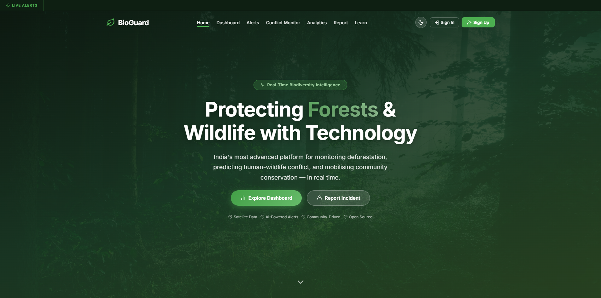

# 🌱 BioGuard NE India

> Empowering conservation efforts in Northeast India through Real-Time Data, Role-Based Collaboration, and Machine Learning.



---

## 🔗 Live Demo
**[Live Demo URL](https://bioguard-xi.vercel.app/)**  


---

## 📖 Overview

BioGuard is a comprehensive web platform designed to assist wildlife conservationists, field workers, and administrators in monitoring environmental incidents, tracking deforestation, and mitigating human-wildlife conflicts in Northeast India. 

The system provides real-time geospatial alerts, an intuitive interactive map, role-based dashboards, and a Machine Learning pipeline to predict wildlife risks based on historical data and environmental factors.

## ✨ Key Features

- **🗺️ Interactive Map & Real-time Alerts**: Visualize incidents (poaching, deforestation, conflicts) on an interactive map powered by Leaflet. Real-time notifications are pushed instantly to connected clients via WebSockets.
- **🔐 Role-Based Access Control**: Secure JWT-based authentication supporting distinct user roles (`Admin`, `Worker`, `User`), each with custom dashboards and permissions.
- **🤖 ML-Powered Risk Prediction**: Built-in Machine Learning model (Random Forest) predicting wildlife risks based on geographic coordinates, forest distance, historical conflicts, and time of day.
- **📊 Comprehensive Analytics**: Detailed charts and statistical analysis of regional alerts and environmental incidents using Recharts.
- **📬 Report Inbox**: A dedicated interface for users to submit on-ground reports, and for administrators to manage and take action on incoming alerts.
- **📱 Responsive & Modern UI**: Built with React and Vite, featuring a sleek, responsive design and intuitive user experience.

---

## 🛠️ Technology Stack

**Frontend**
- React 19 + Vite
- React Router DOM
- Leaflet & React-Leaflet (Geospatial Mapping)
- Recharts (Data Visualization)
- Lucide React (Icons)
- Bootstrap & Custom CSS

**Backend**
- Node.js & Express
- MongoDB & Mongoose
- JSON Web Tokens (JWT) & Google OAuth
- WebSockets (Real-time communication)
- Python, scikit-learn, Flask (Machine Learning Service)
- Nodemailer (Email notifications)

---

## 🚀 Getting Started

Follow these steps to set up the project locally.

### Prerequisites
- Node.js (v16 or higher)
- Python (3.8 or higher)
- MongoDB (Local or Atlas URI)

### 1. Clone the Repository
```bash
git clone https://github.com/ghildiyalnitin067-a11y/Bioguard.git
cd Bioguard
```

### 2. Backend Setup
```bash
cd bioGuard-backend

# Install Node dependencies
npm install

# Setup environment variables
cp .env.example .env
# Edit .env and configure your MONGO_URI, JWT_SECRET, etc.

# Setup Python ML environment
cd ml
pip install -r requirements.txt
python model.py --train # Train the initial model
cd ..

# Start the development server
npm run dev
```
*The Node server will start on port 5000, and the Python ML Flask server will start on port 5001.*

### 3. Frontend Setup
```bash
# Open a new terminal
cd bioguard-frontend

# Install dependencies
npm install

# Start the Vite development server
npm run dev
```
*The frontend will start on port 5173.*

---

## 📁 Repository Structure

```
Bioguard/
├── bioGuard-backend/          # Node.js Express server + MongoDB
│   ├── models/                # Mongoose schemas (User, Alert, Incident, etc.)
│   ├── routes/                # API endpoints
│   ├── services/              # WebSockets, AI Analysis, Email, Seeders
│   ├── ml/                    # Python Flask server & ML Model (scikit-learn)
│   └── server.js              # Entry point
│
└── bioguard-frontend/         # React + Vite frontend
    ├── src/
    │   ├── components/        # Reusable UI components
    │   ├── pages/             # Route pages (Dashboard, Admin, Alerts, etc.)
    │   ├── services/          # API hooks and WebSocket connections
    │   └── context/           # React context (Theme, Auth)
    └── index.html             # Entry point
```

---

## 🤝 Contributing

Contributions, issues, and feature requests are welcome!  
Feel free to check out the [issues page](https://github.com/ghildiyalnitin067-a11y/Bioguard/issues).

---

## 📄 License

This project is open-source and available under the [MIT License](LICENSE).
